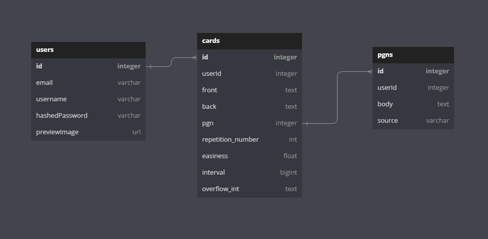

# chesspacing
suite of chess tools

# Features To Implement

i want to be able to automatically import my last 100 games from chess dot com

find my top 5 blunders that led to the highest centipawn loss (according to stockfish)

turn them into flashcards

review them using spaced repetition

# DB Schema

# API Routes

## Endpoints needing authentication

Status code 401, etc. etc.

## Endpoints that require authorization

Status code 403, etc. etc.

## Login/signup stuff

Get current user: GET /users/current
Log in user: POST /session
Sign up user: POST /users

## Card stuff

Get all cards: GET /cards
Create card: POST /cards
Get one card: GET /cards:cardId
Edit card: PUT /cards/:cardId
Delete card: DELETE /cards/:cardId

Note: the idea with each card is that they're probably going to be encoded as FEN or PGN codes.

It doesn't take up that much data to deal with PGN codes, we're just talking about text, after all.

Now, it shouldn't take too much trouble to allow for both codes.

There's assorted data like "relevant game", etc.

There's scheduling data associated with each game!

Sanitizing the data input is going to be complicated. Cards are formatted in HTML, which makes things tricky.
